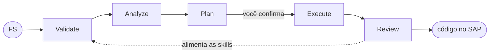

# SAP Accelerate

Acelerador de entrega SAP: leva uma **especificação funcional** até **código ABAP ativado e testado no
sistema**, conduzido por IA e sem sair da conversa. Transcrever o Word, escolher a forma da solução,
nomear os objetos, redigir o TP, estimar, escrever o boilerplate e montar o PR — esse trecho inteiro é
automatizado, com você decidindo o que importa.

## Como funciona

Duas peças, e a separação entre elas é o ponto central do projeto:

- **Um motor determinístico** (CLI em Node) guarda o estado — fase, sub-tasks, aprovações, próximo
  passo. Não escreve nada; só não deixa pular etapa.
- **A IA executa cada passo.** O motor diz que papel assumir e o que gravar; o assistente produz o
  artefato e devolve.

Como o motor é quem decide, **o assistente é intercambiável**: Claude Code, GitHub Copilot e OpenCode
percorrem o mesmo fluxo.



- **Validate** — transcreve a FS e monta o modelo estruturado, a fonte da verdade daqui em diante
- **Analyze** — decide a arquitetura: ABAP clássico, RAP+CDS, Fiori ou configuração
- **Plan** — nomeia os objetos, mapeia FS → TP, estima as horas e gera o TP
- **Execute** — escreve o ABAP e o leva pela validação técnica, pelo refinamento e pelo PR
- **Review** — entrega a feature e registra o aprendizado nas skills

O ciclo espera por você em dois pontos: a **V** bloqueia enquanto a especificação estiver incompleta,
e o plano só vira código depois da sua confirmação.

## Instalação

```bash
pnpm install
```

Requisitos: Node.js 24+ e pnpm 11+.

## Como configurar

Uma única vez, a partir dos modelos versionados. Para o **Azure DevOps**, copie o `.env.example` para
`.env` e preencha a organização, o projeto, a URL e o seu token de acesso. Para o **SAP**, copie os
`*.exemplo.json` de `.lib/adt/` e preencha o `sistemas.json` (a URL do ADT de cada sistema) e o
`destinos.json` (onde os objetos são gravados em disco). Para o **vocabulário do cliente**, copie
`.vaper/organization.exemplo.json` para `organization.json` e preencha os workstreams, os países e
como eles aparecem escritos nas FSs.

A lista de sistemas vem do próprio SAP GUI, então não precisa ser mantida à mão. A senha SAP não fica
em arquivo nenhum — é perguntada na hora. Todos esses arquivos são gitignored: nada de um cliente
entra no repositório. Sem eles o motor roda com um vocabulário neutro.

## Como usar

**Você não digita comandos.** Descreve o que quer; o agente executa o CLI e faz o loop sozinho até o
ciclo fechar ou até esbarrar num gate humano.

No Claude Code, dispare com `/vaper-run <feature-id>`. No GitHub Copilot, selecione o agente
**vaper-orchestrator** ou use o prompt `vaper-run`.

| Você diz | O agente faz |
|---|---|
| "O que eu tenho para hoje?" | Lê seus itens de trabalho no DevOps e monta o painel com as tasks locais |
| "Baixa o FS da feature 1000009" | Traz o anexo do DevOps para o backlog (em lote: "baixa todos os meus TPs") |
| "Cria a feature 1000001" | Importa o FS, renomeia para o nome canônico e monta a task com toda a cascata de sub-tasks |
| "Roda o ciclo" | Percorre V → A → P → E → R, parando nos gates: transcreve a FS, decide a arquitetura, gera o TP com estimativa e diagrama, escreve o ABAP e o PR |
| "Aprovado" / "rejeita, o campo X está errado" | Passa ou devolve o gate; no refinamento funcional, aplica os ajustes no TP e no código e pergunta de novo |
| "Publica o TP da 1000010" | Anexa o TP na feature no DevOps, move o item para refinamento e cria a task de design técnico |
| "Retoma a feature 1000001" | Reconstrói o estado a partir do disco — uma sessão nova de IA não lembra da conversa |

Os gates humanos são conversacionais: o agente mostra o que abrir e o critério de OK. O plano precisa
da sua confirmação antes de virar código. E tudo que escreve no DevOps roda em **dry-run por padrão** —
mostra o plano antes, executa só com confirmação.

## Entrega no SAP

O client **ADT REST** de `.lib/adt` fala direto com o SAP a partir da sua máquina, com o seu usuário
SAP: cria e altera os objetos, ativa e valida com **ABAP Unit e cobertura**. Guard-rails: só objetos
**Z/Y**, `unlock` sempre, leitura de dados somente leitura e exclusão apenas com confirmação
explícita.

As receitas por tipo de objeto e os erros já mapeados estão nas skills `abapgit` e `adt-objetos`.

## Sobre o autor

**Joris Veloso** — programador há mais de 30 anos e consultor SAP ABAP há mais de 20.

Contato: [joris.barrozo.veloso@accenture.com](mailto:joris.barrozo.veloso@accenture.com) ·
[jorisveloso@gmail.com](mailto:jorisveloso@gmail.com) ·
[GitHub](https://github.com/jorisveloso)
